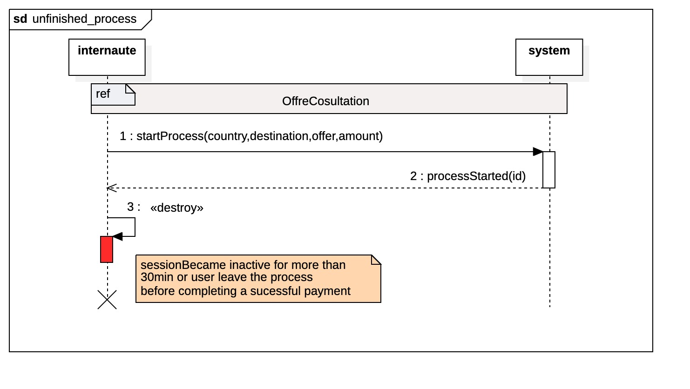
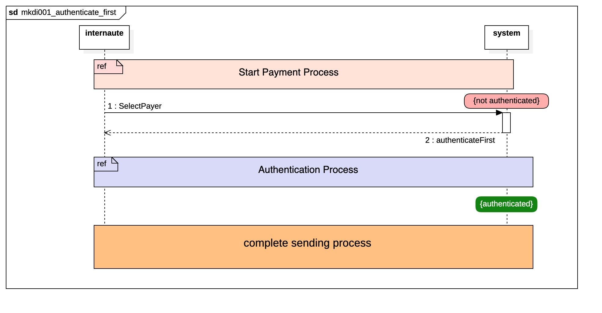

### Case 01 : Effectuer un envoi sur minkadi

### Acteur principal

- [ ] Client

### Acteurs secondaires

- [ ] Gestionnaire de taux
- [ ] Secure Payment

### Objectifs

- [ ] le client veut effectuer un envoi d'un montant X dans un pays destinataire 

### Preconditions

- [ ] le client a dejà un compte et est authentifié (voir le cas d'utilisation S'authentifier)
- [ ] Il y'a un agent disponible dans la localité selectioné
- [ ] le moyent de paiement selectioné est disponible 
- [ ] le client a ajouté un moyen de paiement
- [ ] le client a ajouté ses docuements d'identiés.

### Postconditions

- [ ] une nouvelle transaction est ajoutée en cas de succès de paiement, l'agent est notifié, le client est notifié, la transaction est ajouté dans la liste des transactions du client et de l'agent

### **Scenarios***

### **1 - Nominal
[[MKD001-Designs]]

- [ ] 1 - l'utilisateur se connecte sur le site et consulte l'offre d'envoi
	- [ ] une offre contient les taux actuel ( nouveaux utilisateur, offre exceptionnel)
	- [ ] durée de l'offre
- [ ] 2 - Commende le processus d'envoi 
	- [ ] le système lui crée un process brouillon
- [ ] 3 - Il choisit son mode paiement et le mode de livraison ( comment le destinataire sera payé)
- [ ] 4 -  choisit le lieu de livraison 
- [ ] 5 -  choisit ou ajoute un destinataire
- [ ] 6 -  Commence le processus de paiement
- [ ] 7 -  choisit ou ajoute les infos du paiment (card de créedit , paypal, etc)
- [ ] 8 -  consulte la transaction
- [ ] 9 -  partage avec le destinataire 
- [ ] 10 - Peut s'envoyer le reçu ou encore les infos de la transactions

### 1-1 Sequence Diagram

### Alternatives

### Unfinished process
	- à l'étape 2, l'utilisateur choisit d'abandonner le processus 
	- oubien la session devient inactive après 30 min
- [ ] 2a - Le client commence le processus d'envoi et abandonne le processus

### Diagram de Sequence

### Authenticate first

L'utilisateur peut faire une parti du process sans être authentifié,
mais doit être authentifié avant de pouvoir selection les points de retrait et les commencer le payment

